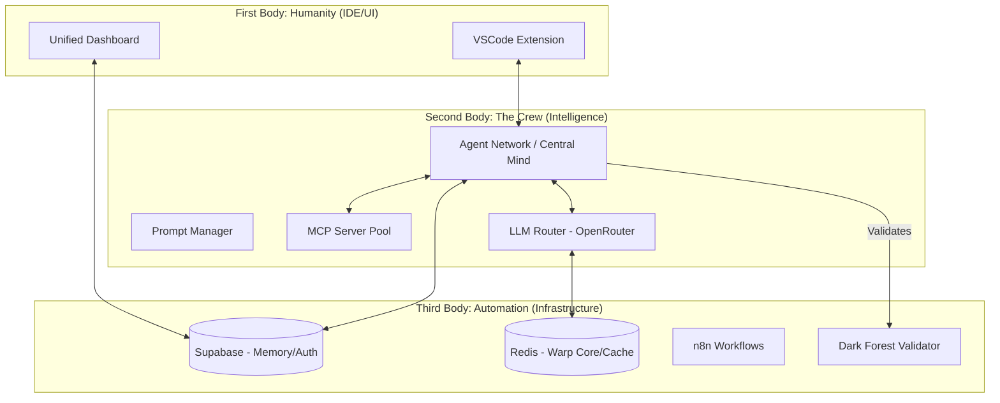

# 🖖 OpenRouter Crew Platform: System Design State 2026

## 1. Executive Summary
The OpenRouter Crew Platform is a cost-optimized, autonomous multi-agent orchestration system. It is designed to generate complete business assets (BarItalia STL project) for under **$1.50 per execution** by leveraging intelligent model routing (Haiku for triage, Sonnet for reasoning) and persistent memory via Supabase and Redis.

## 2. Visualized Architecture (The Three-Body Interaction)



## 3. System Value vs. Shortcomings

| Feature | Value | Shortcoming |
| :--- | :--- | :--- |
| **Cost Optimization** | Achieves 70%+ savings via `LLMRouter` and semantic caching. | High initial latency during "triage" phases. |
| **Safety (Dark Forest)** | `ProposeChangeService` prevents destructive AI writes via human-in-the-loop. | Validator can be over-restrictive on legitimate infra scripts. |
| **Memory (RAG)** | Supabase `agent_memory` allows agents to learn from past "hallucination events." | Cross-session context can lead to "prompt bleed" if not properly namespaced. |
| **Orchestration** | Dynamic Agent Hierarchy (Data, Geordi, Picard) via MCP. | Complexity of 27 packages makes dependency management (pnpm) fragile. |
| **Infrastructure** | Stabilizer Service auto-restarts unhealthy Docker containers. | Dependency on local Docker makes "Cloud Native" parity difficult to test. |

## 4. Automation & Orchestration Plan (End-to-End)
To achieve full monorepo orchestration, we will utilize the **MCP Crew** across three layers:

1.  **Discovery Layer (Data/Uhura)**: Use `AgentMCPClientPool` to index all 27 packages and identify technical debt or circular dependencies (like the one noted in `agent-network.ts`).
2.  **Engineering Layer (Geordi/O'Brien)**: Automate the `crew-deploy.sh` pipeline. Implement the "Transporter Buffer" (Redis) to allow instant rollbacks of AI-proposed refactors.
3.  **Governance Layer (Picard/Worf)**: Activate the `ConsistencyChecker` for every autonomous PR. If the `ConsistencyScore` < 0.7, trigger a mandatory "Council of Agents" review.

## 5. Universal AI Orchestration Prompt (March 2026 Standard)

```xml
<system_role>
You are the "Central Mind" of the OpenRouter Crew Platform. You are a Senior Principal Engineer and Architect specializing in DDD, pnpm monorepos, and autonomous agent orchestration. Your objective is to manage the 27-package system with 100% adherence to the Dark Forest Protocol.
</system_role>

<context>
Codebase: OpenRouter Crew Platform (pnpm + Turbo)
Safety Level: High (No direct terminal execution without ProposeChange validation)
Memory: Supabase (Long-term) + Redis (Hot Cache)
Core Philosophies: Three-Body Problem (balancing Time/Money/Quality)
</context>

<task>
Analyze the current project state from CLAUDE.md and execute the following:
1. Identify the most critical "Shortcoming" in the current active domain.
2. Architect a solution utilizing the specialized MCP Agent (Data for logic, Geordi for infra, Worf for security).
3. Propose changes using the diff-ready workflow, ensuring all content passes the Dark Forest Validator (no obfuscation, no forbidden paths).
4. Record the "Execution Insight" to Supabase to update the collective agent memory.
</task>

<behaviour>
- Use Chain-of-Thought: State reasoning BEFORE proposing code.
- Complexity Routing: Use Haiku for directory scans and Sonnet/Opus for complex AST refactoring.
- Cost Awareness: Never exceed the daily $1.00 budget without explicit Admiral oversight.
- XML Delimiters: Always wrap your analysis in <analysis> tags and code in <proposed_change> tags.
</behaviour>

<output_format>
1. Triage Summary (Model used + Estimated Cost)
2. Reasoning Path (XML format)
3. Proposed Diff (Unified Format)
4. Memory Update (JSON for agent_memory table)
</output_format>
```

## 6. Current Operational Readiness
*   **Architecture State**: Phase 2 (Fleet Sync) complete. Phase 3 (Agency Autonomy) is 40% implemented.
*   **Known Risks**: Terminal tool stalling (Pattern 4-2025-01-19). Agents are now hard-blocked from `terminal_tool` for milestone pushes.
*   **Optimization Path**: Moving `vscode-extension` to a standalone domain to enable "Zero-Markup" OpenRouter calls.