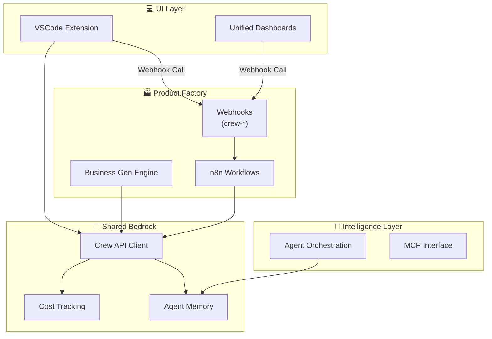

# 🗺️ Monorepo Visualization Map

## 🏗️ Structural Architecture



## 🍱 Nano-Bento System Status

| Domain | Health | Build | Dependencies |
| :--- | :--- | :--- | :--- |
| **Shared** | ✅ | Passing | 10 Packages |
| **Intelligence** | 🧠 | Passing | 2 Packages |
| **VSCode** | 💻 | Passing | @openrouter-crew/shared |
| **Factory** | 🏭 | Active (Webhook Linked) | n8n, Supabase |

## 🔗 Dependency Graph: @dj-studio/booking-agent

This graph illustrates the direct dependencies of the `@dj-studio/booking-agent` package.

```mermaid
graph TD
    A[@dj-studio/booking-agent] --> B[@anthropic-ai/sdk]
    A --> C[@modelcontextprotocol/sdk]
    A --> D[axios]
    A --> E[cors]
    A --> F[dotenv]
    A --> G[express]
    A --> H[pg]
    A --> I[winston]
```

## �️ Protocol Context
- **Dark Forest Protocol:** Enabled. All AI changes require verification.
- **Model Routing:** Optimized via `LLMRouter`.
- **Observability:** 4/4 Hallucination Event Logs Integrated.

---
*Generated by Gemini Code Assist - 2026 Standards*